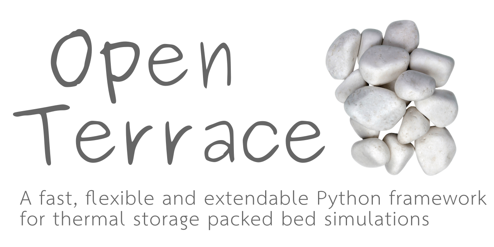

Open Terrace is a pure Python framework for thermal energy storage packed bed simulations. It is built on a modern Python 3.9 with speed in mind and runs on CUDA with automatic fallback to CPU.

Open Terrace uses awesome open-source software such as
[Numba](https://numba.pydata.org), [NumPy](https://numpy.org/) and [SciPy](https://scipy.org/):grey_exclamation:
## Why Open Terrace?

- **FLEXIBLE**. Open Terrace is built from the ground up to be flexible and allow storage systems to be included.
- **FAST**. By making use of modern compilers, Open Terrace approaches speeds of C or FORTRAN code.
- **EXTENDABLE**. Modules for different materials such as non-sperical rocks or exotic Phase Change Materials (PCM) can easily be included.

## Contributors
* Jakob Hærvig

## Want to contribute?

Contributions are welcome :pray: Feel free to send pull requests or get in touch with me to discuss how to collaborate.