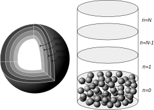

# Theory

## Schematic overview
The fluid and bed phase are discretised in *N* and *M* nodes respectively. All bed material within the same fluid node is assumed to have the same temperature distribution.

## Governing equations
OpenTerrace solves partial differential equations for both phases.

$$
\epsilon_f \rho_f c_{p,f} \frac{\partial T}{\partial t} = - \rho_f c_{p,f} u \frac{\partial T}{\partial x} + \frac{\partial}{\partial x}\left( k_f\frac{\partial T}{\partial x}\right) + S
$$

$$
\epsilon_b \rho_b c_{p,b} \frac{\partial T}{\partial t} = \frac{\partial}{\partial x}\left( k_b\frac{\partial T}{\partial x}\right) + S
$$

The source term *S* contains effects such as coupling between the phases or heat loss to surroundings.